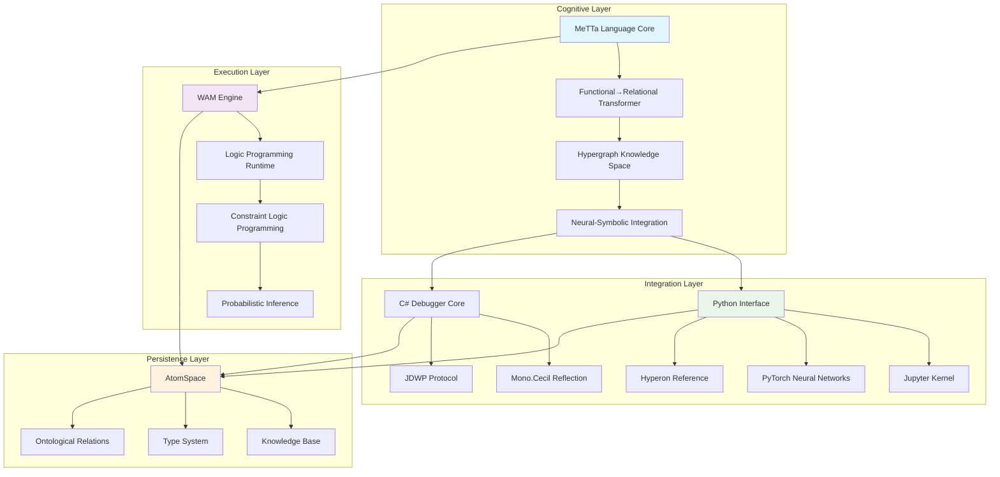
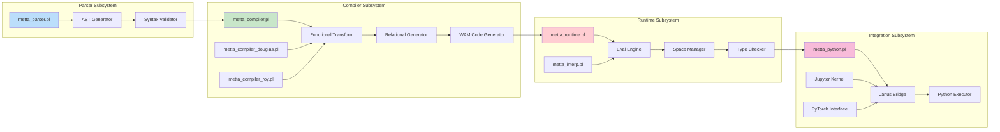
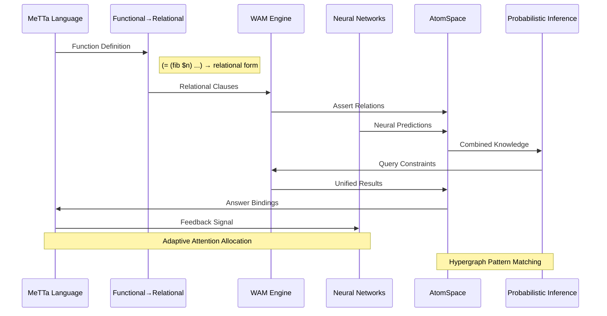
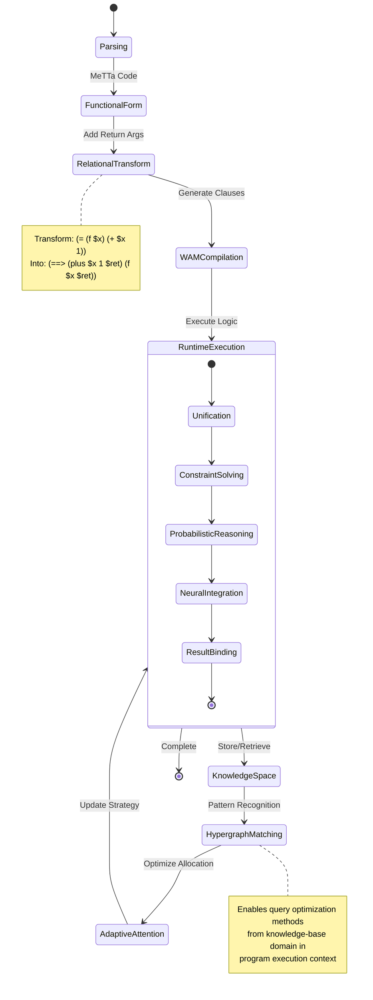
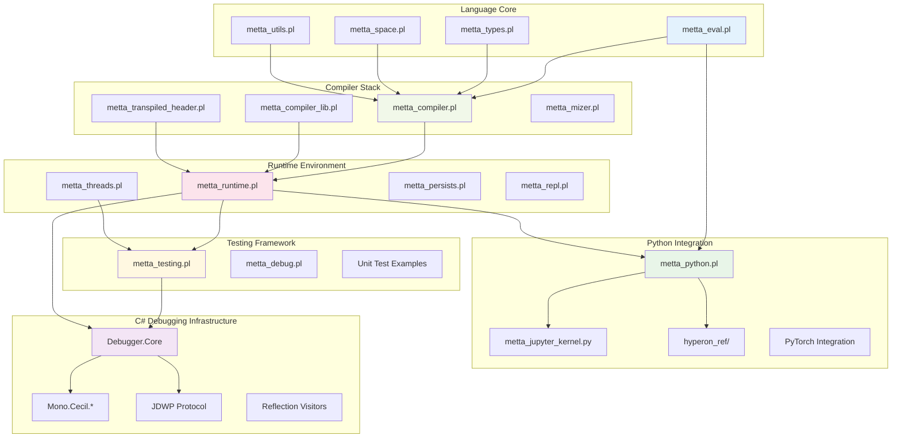
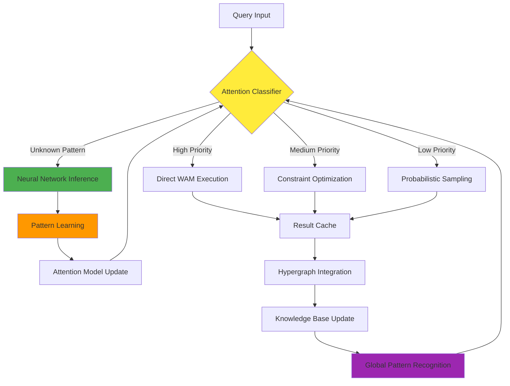
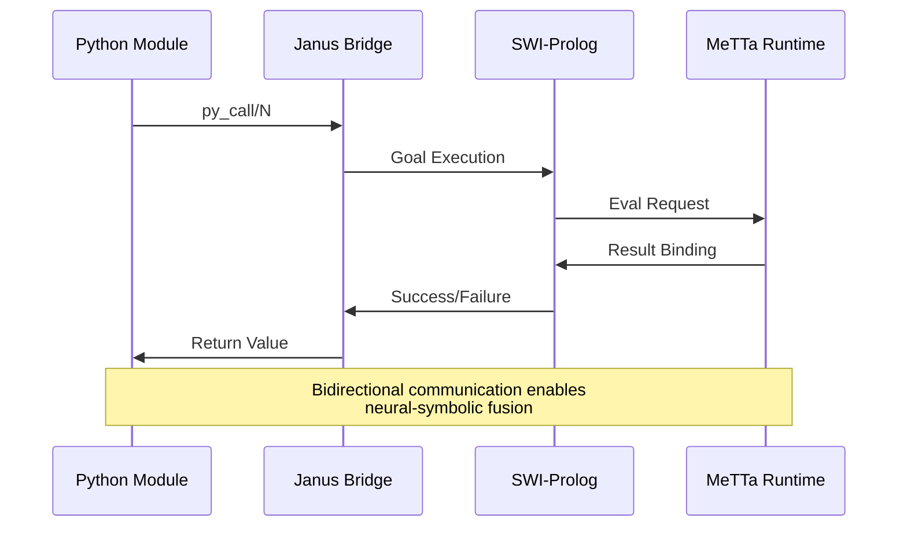

# MeTTa-WAM Architecture Documentation

## Overview

The MeTTa-WAM (Meta-learning Warren Abstract Machine) represents a revolutionary cognitive architecture that transmutes functional programming into relational programming, enabling neural-symbolic integration through hypergraph-centric computation. This system facilitates distributed cognition by transforming implicit architectural patterns into explicit, actionable knowledge.

## High-Level System Architecture

## Core Module Interaction Patterns

## Neural-Symbolic Integration Architecture

## Data Flow and Signal Propagation

## Component Relationship and Dependencies

## Emergent Cognitive Patterns

### Recursive Implementation Pathways

The system exhibits recursive cognitive patterns through multiple architectural layers:

1. **Functional Recursion → Relational Recursion**: Functions like `(fib $n)` become self-referential relations with constraint propagation
2. **Meta-Circular Evaluation**: The MeTTa interpreter can reason about its own evaluation processes
3. **Hypergraph Recursion**: Knowledge patterns recursively reference and expand through the atomspace

### Adaptive Attention Allocation Mechanisms

### Cognitive Synergy Optimizations

The architecture achieves cognitive synergy through:

- **Cross-Modal Learning**: Neural predictions inform symbolic reasoning and vice versa
- **Temporal Coherence**: State maintenance across recursive evaluation cycles
- **Emergent Abstraction**: Higher-order patterns emerge from low-level symbolic manipulation
- **Distributed Inference**: Computation distributes across multiple reasoning modalities

## Integration Points and Bridges

### Python-Prolog Bridge (Janus)

### C# Debugging Integration

The C# debugging infrastructure provides deep introspection capabilities:

- **Mono.Cecil**: Assembly analysis and code reflection
- **JDWP Protocol**: Remote debugging and process control
- **Visitor Patterns**: Systematic traversal of code structures
- **Metadata Extraction**: Type information and dependency analysis

## Future Architectural Evolution

The system's hypergraph-centric design enables continuous architectural evolution through:

1. **Pattern Emergence**: New computational patterns emerge from symbolic-neural interaction
2. **Self-Modification**: The system can reason about and modify its own architecture
3. **Distributed Cognition**: Multiple reasoning agents can collaborate within the same atomspace
4. **Quantum-Ready**: The relational foundation supports future quantum computing integration

## Technical Implementation Notes

### Warren Abstract Machine Optimization

The WAM engine provides efficient execution through:
- First-argument indexing for predicate dispatch
- Structure sharing for term representation
- Tail-call optimization for recursive functions
- Cut elimination for deterministic execution paths

### Type System Integration

The ontological type system bridges:
- Regular types (functional programming)
- Dependent types (theorem proving)
- Ontological types (knowledge representation)
- Neural types (continuous embeddings)

This comprehensive architecture documentation captures the emergent, recursive, and adaptive nature of the MeTTa-WAM system, facilitating distributed cognition for all contributors through precise technical exposition and visual architectural mapping.