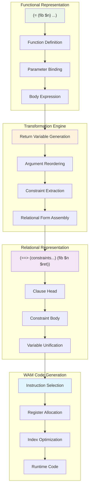
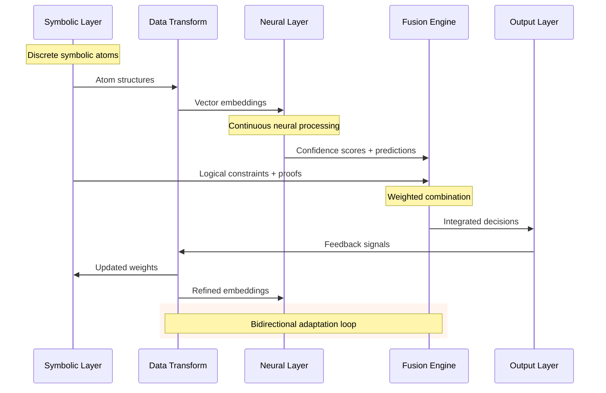
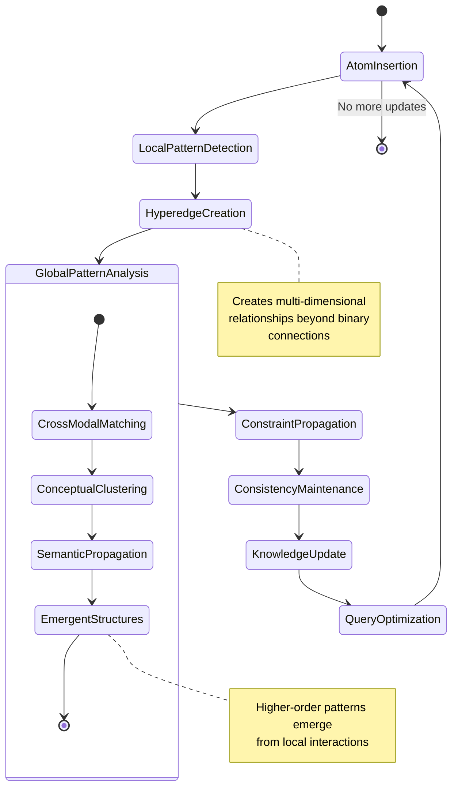
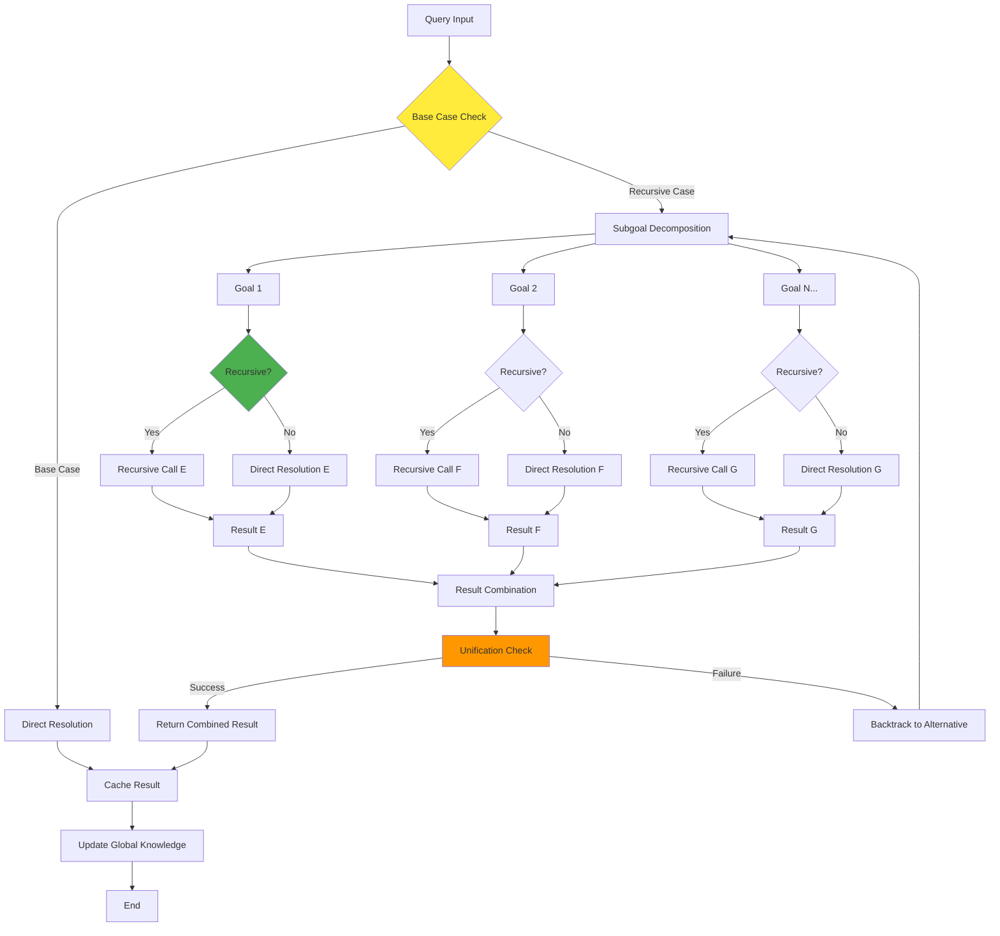
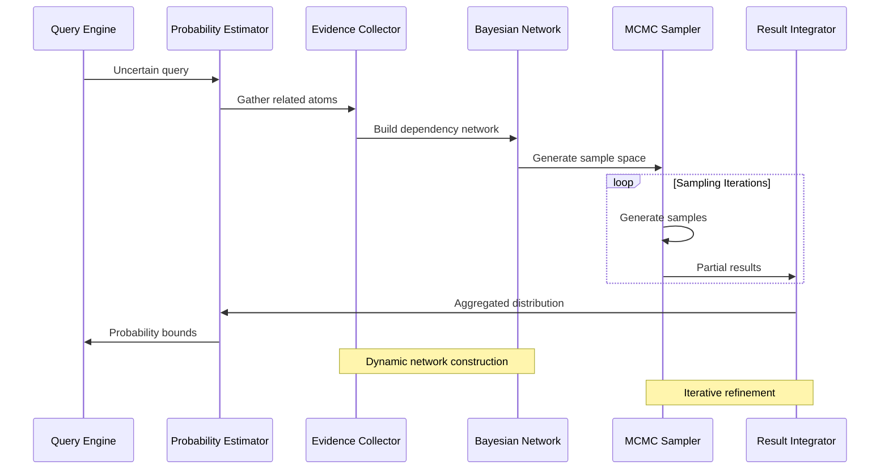
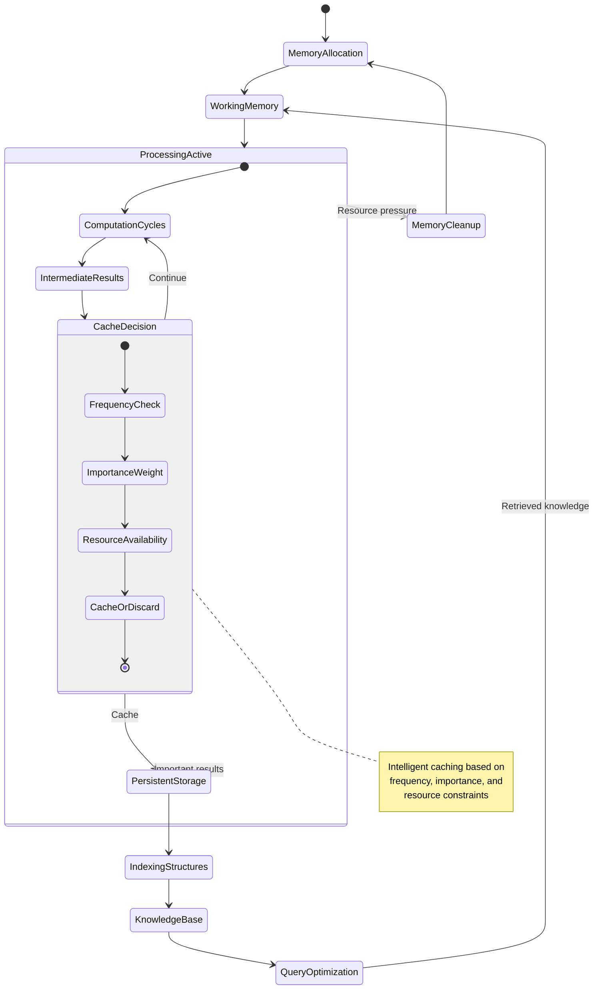
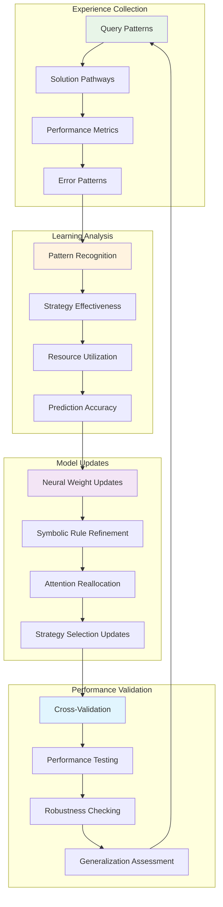
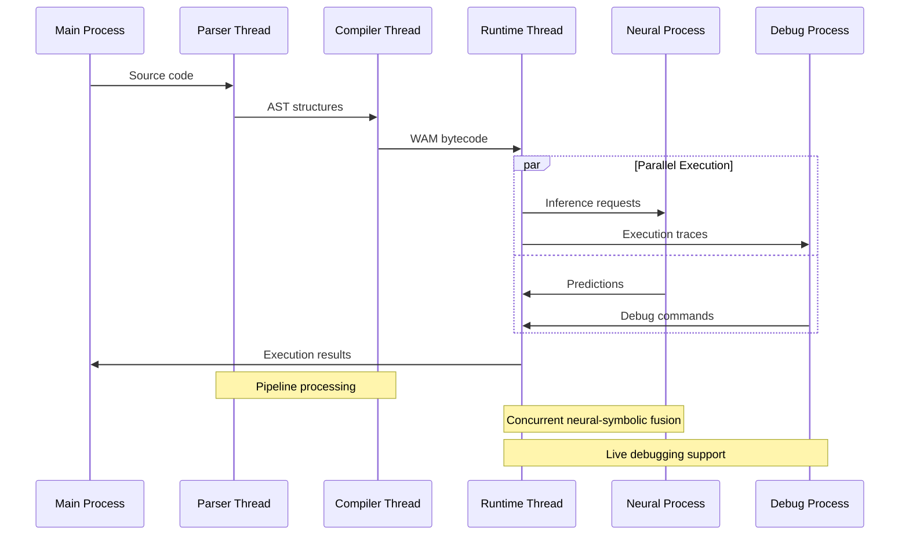
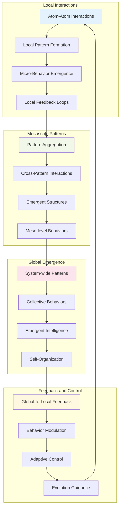

# MeTTa-WAM Data Flow and Signal Propagation Patterns

This document captures the recursive and emergent data flow patterns within the MeTTa-WAM cognitive architecture, illustrating how information propagates through the hypergraph-centric computation framework.

## Functional to Relational Transformation Pipeline

## Neural-Symbolic Information Flow

## Hypergraph Pattern Propagation

## Recursive Evaluation Flow

## Constraint Satisfaction Data Flow

```mermaid
graph LR
    subgraph "Constraint Generation"
        CG1[Variable Domains] --> CG2[Constraint Relations]
        CG2 --> CG3[Dependency Graph]
        CG3 --> CG4[Propagation Rules]
    end
    
    subgraph "Constraint Propagation"
        CP1[Arc Consistency] --> CP2[Path Consistency]
        CP2 --> CP3[Global Consistency]
        CP3 --> CP4[Solution Space Pruning]
    end
    
    subgraph "Solution Search"
        SS1[Variable Ordering] --> SS2[Value Selection]
        SS2 --> SS3[Backtrack Control]
        SS3 --> SS4[Solution Generation]
    end
    
    subgraph "Optimization"
        OP1[Constraint Reordering] --> OP2[Redundancy Elimination]
        OP2 --> OP3[Performance Metrics]
        OP3 --> OP4[Strategy Adaptation]
    end
    
    CG4 --> CP1
    CP4 --> SS1
    SS4 --> OP1
    OP4 --> CG1
    
    style CG1 fill:#e3f2fd
    style CP1 fill:#f1f8e9
    style SS1 fill:#fce4ec
    style OP1 fill:#fff8e1
```

## Probabilistic Inference Pipeline

## Memory and Persistence Flow

## Adaptive Learning Signal Flow

## Inter-Process Communication Patterns

## Emergent Behavior Signal Propagation

These data flow patterns illustrate how the MeTTa-WAM system achieves emergent cognition through recursive information propagation, adaptive learning signals, and multi-scale pattern recognition. The hypergraph-centric approach enables complex reasoning patterns that transcend traditional computational boundaries, creating a truly adaptive and intelligent cognitive architecture.