# MeTTa-WAM Implementation Pathways and Technical Specifications

This document provides deep technical insights into the recursive implementation pathways and cognitive optimization mechanisms within the MeTTa-WAM architecture.

## Warren Abstract Machine Implementation Details

```mermaid
graph TB
    subgraph "WAM Memory Areas"
        WM1[Heap] --> WM2[Stack]
        WM2 --> WM3[PDL (Push Down List)]
        WM3 --> WM4[Trail]
        WM4 --> WM5[Code Area]
    end
    
    subgraph "WAM Registers"
        WR1[Argument Registers A1-An] --> WR2[Structure Pointer S]
        WR2 --> WR3[Heap Pointer H]
        WR3 --> WR4[Program Counter P]
        WR4 --> WR5[Choice Point B]
        WR5 --> WR6[Environment E]
    end
    
    subgraph "WAM Instructions"
        WI1[put_structure/2] --> WI2[get_structure/2]
        WI2 --> WI3[unify_variable/1]
        WI3 --> WI4[unify_value/1]
        WI4 --> WI5[call/1]
        WI5 --> WI6[proceed/0]
    end
    
    subgraph "Optimization Layers"
        OL1[First Argument Indexing] --> OL2[Clause Indexing]
        OL2 --> OL3[Cut Optimization]
        OL3 --> OL4[Tail Call Optimization]
        OL4 --> OL5[Structure Sharing]
    end
    
    WM5 --> WR1
    WR6 --> WI1
    WI6 --> OL1
    
    style WM1 fill:#e3f2fd
    style WR1 fill:#f1f8e9
    style WI1 fill:#fce4ec
    style OL1 fill:#fff8e1
```

## Functional to Relational Transformation Algorithm

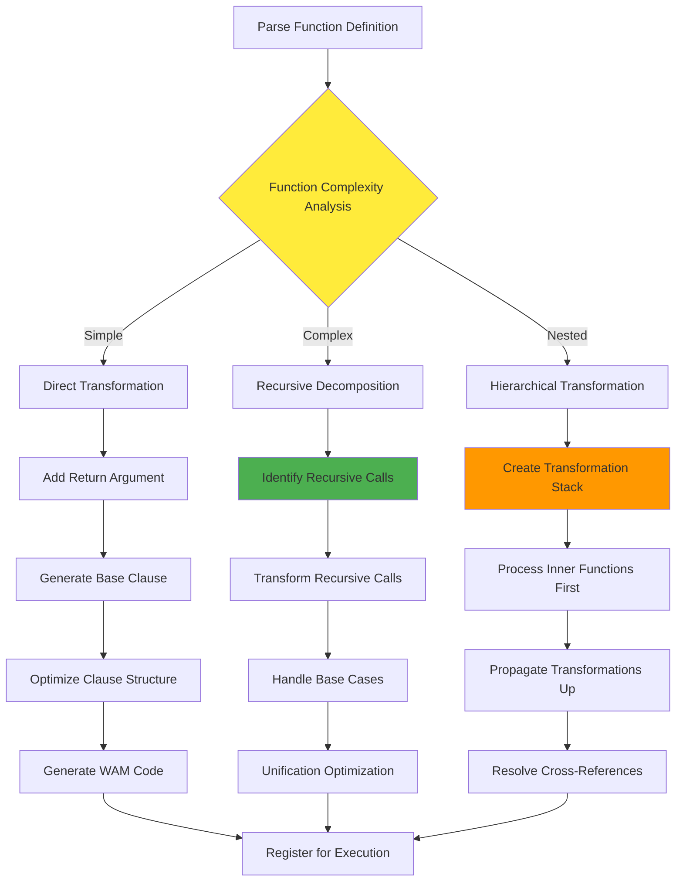

## Constraint Logic Programming Integration

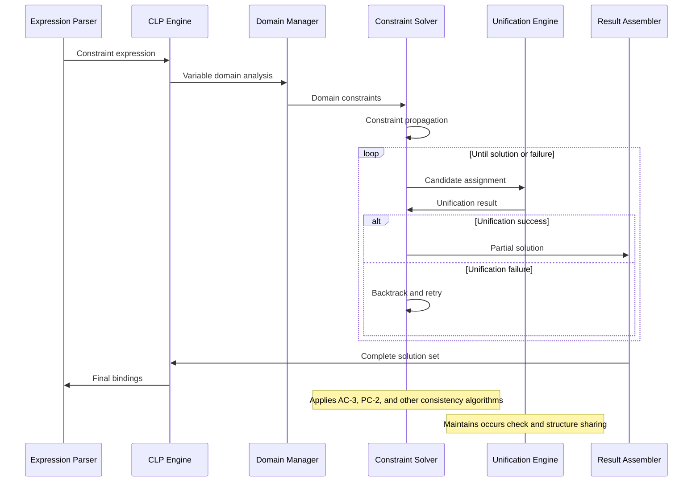

## Neural Network Integration Architecture

```mermaid
graph LR
    subgraph "Symbolic Input Processing"
        SI1[Atom Structure] --> SI2[Feature Extraction]
        SI2 --> SI3[Vector Encoding]
        SI3 --> SI4[Normalization]
    end
    
    subgraph "Neural Processing Layers"
        NP1[Input Layer] --> NP2[Hidden Layers]
        NP2 --> NP3[Attention Mechanisms]
        NP3 --> NP4[Output Layer]
    end
    
    subgraph "Symbolic Output Processing"
        SO1[Confidence Scores] --> SO2[Threshold Application]
        SO2 --> SO3[Atom Generation]
        SO3 --> SO4[Knowledge Integration]
    end
    
    subgraph "Feedback Learning"
        FL1[Error Computation] --> FL2[Gradient Calculation]
        FL2 --> FL3[Weight Updates]
        FL3 --> FL4[Performance Monitoring]
    end
    
    SI4 --> NP1
    NP4 --> SO1
    SO4 --> FL1
    FL4 --> SI1
    
    style SI1 fill:#e8f5e8
    style NP1 fill:#fff3e0
    style SO1 fill:#f3e5f5
    style FL1 fill:#e1f5fe
```

## Hypergraph Storage and Indexing

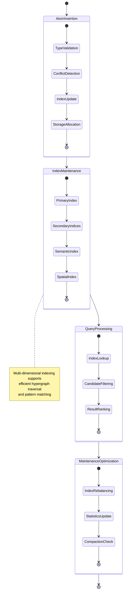

## Recursive Cognitive Processing Implementation

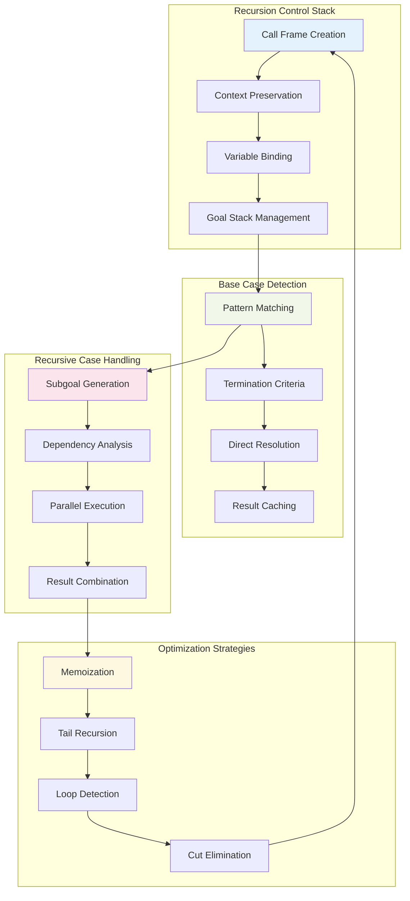

## Multi-Threading and Parallelization

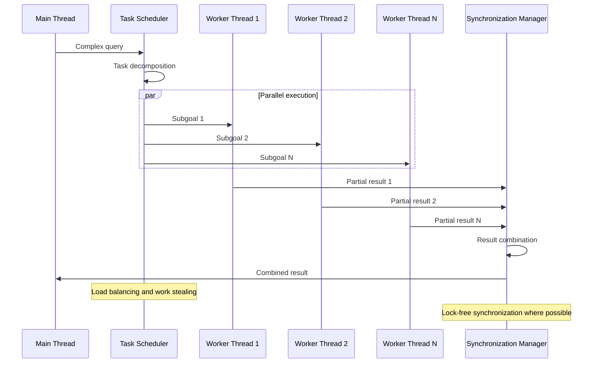

## Python-Prolog Bridge Implementation

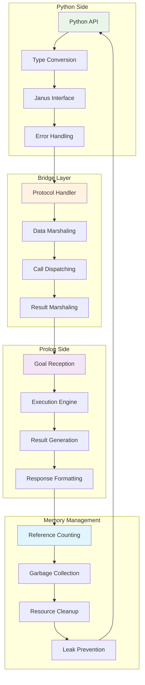

## Type System Implementation

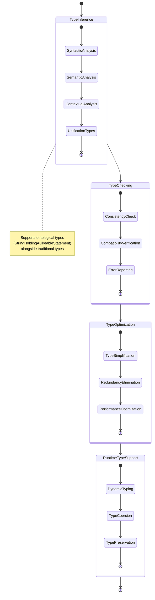

## Memory Management and Garbage Collection

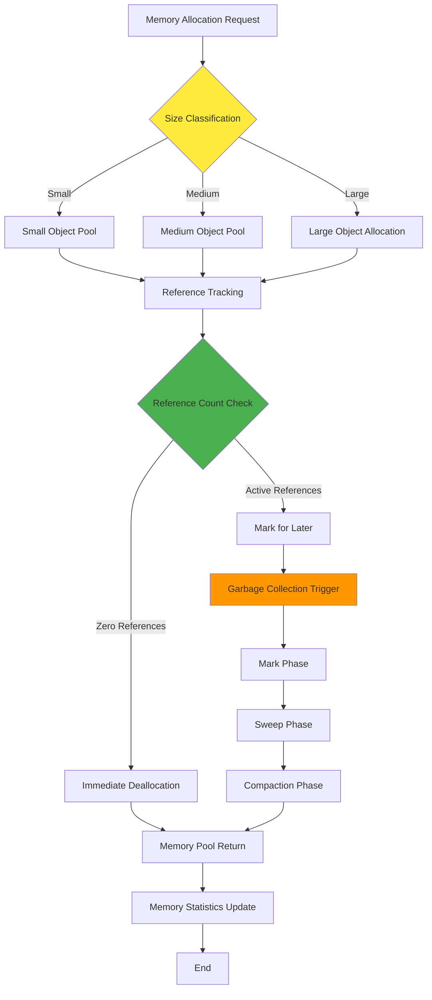

## Performance Monitoring and Optimization

```mermaid
graph LR
    subgraph "Metrics Collection"
        MC1[Execution Time] --> MC2[Memory Usage]
        MC2 --> MC3[Query Patterns]
        MC3 --> MC4[Resource Utilization]
    end
    
    subgraph "Analysis Engine"
        AE1[Statistical Analysis] --> AE2[Trend Detection]
        AE2 --> AE3[Bottleneck Identification]
        AE3 --> AE4[Optimization Opportunities]
    end
    
    subgraph "Optimization Actions"
        OA1[Code Restructuring] --> OA2[Index Rebuilding]
        OA2 --> OA3[Caching Strategy Update]
        OA3 --> OA4[Resource Reallocation]
    end
    
    subgraph "Feedback Loop"
        FL1[Performance Validation] --> FL2[Impact Assessment]
        FL2 --> FL3[Strategy Refinement]
        FL3 --> FL4[Continuous Learning]
    end
    
    MC4 --> AE1
    AE4 --> OA1
    OA4 --> FL1
    FL4 --> MC1
    
    style MC1 fill:#e3f2fd
    style AE1 fill:#f1f8e9
    style OA1 fill:#fce4ec
    style FL1 fill:#fff8e1
```

## Error Handling and Recovery Mechanisms

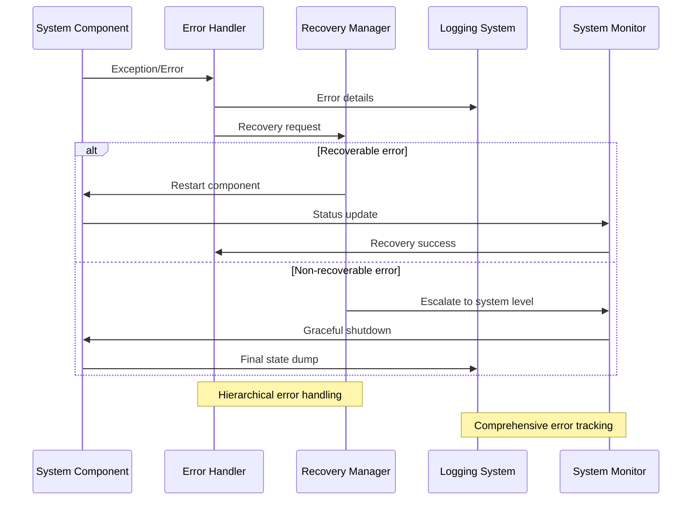

These implementation pathways demonstrate the sophisticated engineering required to achieve the emergent cognitive behaviors of the MeTTa-WAM system. The recursive implementation patterns, adaptive optimization mechanisms, and robust error handling create a foundation for transcendent neural-symbolic computation that can evolve and adapt to new cognitive challenges.