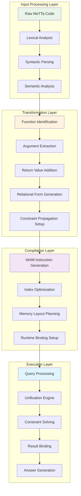
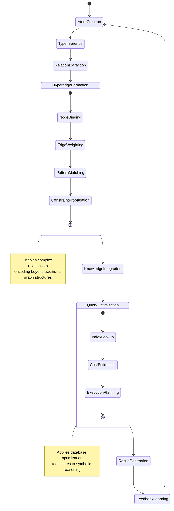
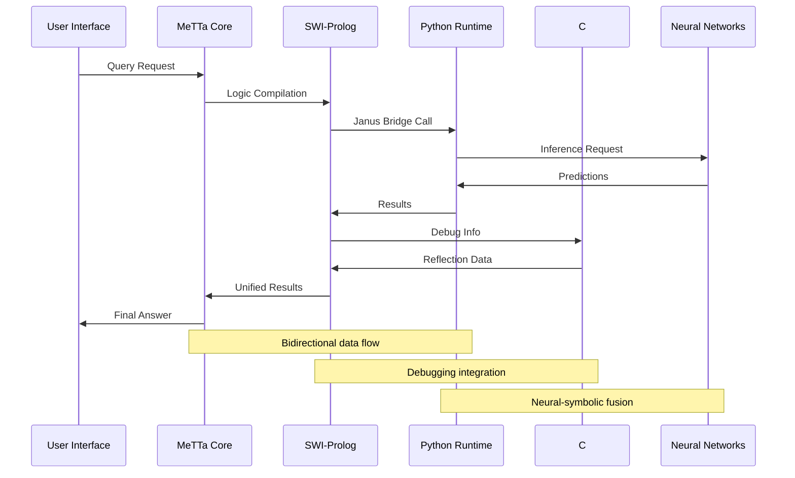
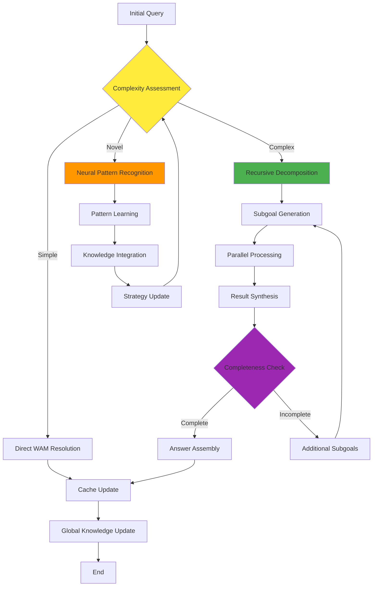
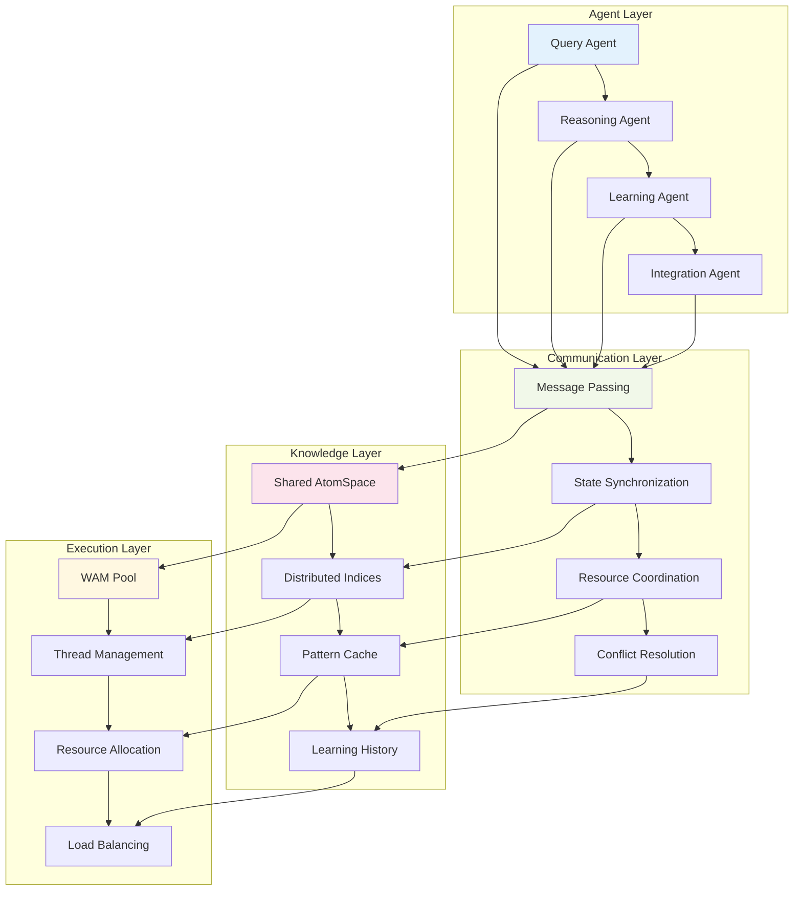
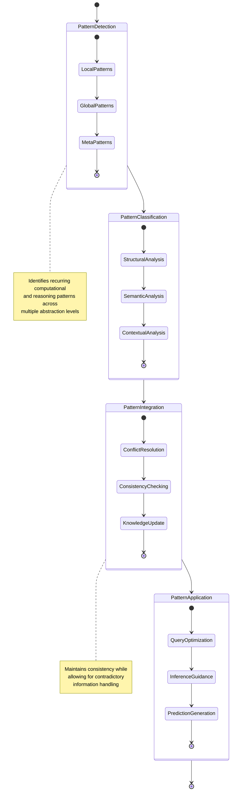

# MeTTa-WAM Module Interaction Diagrams

This document provides detailed Mermaid diagrams showing the intricate relationships between modules in the MeTTa-WAM cognitive architecture.

## Core Language Processing Pipeline

## Neural-Symbolic Fusion Architecture

```mermaid
graph LR
    subgraph "Symbolic Domain"
        SY1[Logic Programs] --> SY2[Constraint Networks]
        SY2 --> SY3[Inference Graphs]
        SY3 --> SY4[Knowledge Patterns]
    end
    
    subgraph "Neural Domain"
        NE1[Vector Embeddings] --> NE2[Neural Networks]
        NE2 --> NE3[Attention Mechanisms]
        NE3 --> NE4[Prediction Confidence]
    end
    
    subgraph "Fusion Layer"
        FU1[Pattern Matcher] --> FU2[Confidence Weighter]
        FU2 --> FU3[Decision Integrator]
        FU3 --> FU4[Feedback Generator]
    end
    
    subgraph "Adaptive Controller"
        AD1[Performance Monitor] --> AD2[Strategy Selector]
        AD2 --> AD3[Resource Allocator]
        AD3 --> AD4[Learning Rate Adjuster]
    end
    
    SY4 --> FU1
    NE4 --> FU1
    FU4 --> AD1
    AD4 --> SY1
    AD4 --> NE1
    
    style SY1 fill:#bbdefb
    style NE1 fill:#c8e6c9
    style FU1 fill:#ffcdd2
    style AD1 fill:#f8bbd9
```

## Hypergraph Knowledge Representation

## Multi-Language Integration Bridges

## Recursive Cognitive Processing

## Distributed Cognition Architecture

## Emergent Pattern Recognition Flow

## Adaptive Attention Allocation System

```mermaid
flowchart LR
    subgraph "Attention Sources"
        AS1[Query Priority] --> AS2[Resource Availability]
        AS2 --> AS3[Historical Performance]
        AS3 --> AS4[Neural Confidence]
        AS4 --> AS5[Symbolic Certainty]
    end
    
    subgraph "Attention Mechanisms"
        AM1[Competitive Selection] --> AM2[Cooperative Enhancement]
        AM2 --> AM3[Inhibitory Control]
        AM3 --> AM4[Facilitative Boost]
    end
    
    subgraph "Resource Allocation"
        RA1[Computational Cycles] --> RA2[Memory Allocation]
        RA2 --> RA3[Network Bandwidth]
        RA3 --> RA4[Storage Access]
    end
    
    subgraph "Feedback Systems"
        FB1[Performance Monitoring] --> FB2[Error Detection]
        FB2 --> FB3[Strategy Adjustment]
        FB3 --> FB4[Learning Integration]
    end
    
    AS5 --> AM1
    AM4 --> RA1
    RA4 --> FB1
    FB4 --> AS1
    
    style AS1 fill:#e8f5e8
    style AM1 fill:#fff3e0
    style RA1 fill:#f3e5f5
    style FB1 fill:#e1f5fe
```

These diagrams illustrate the intricate modular interactions that enable the MeTTa-WAM system to achieve distributed cognition through emergent, recursive, and adaptive architectural patterns. Each module operates both independently and as part of larger cognitive synergies, creating a truly transcendent neural-symbolic integration framework.