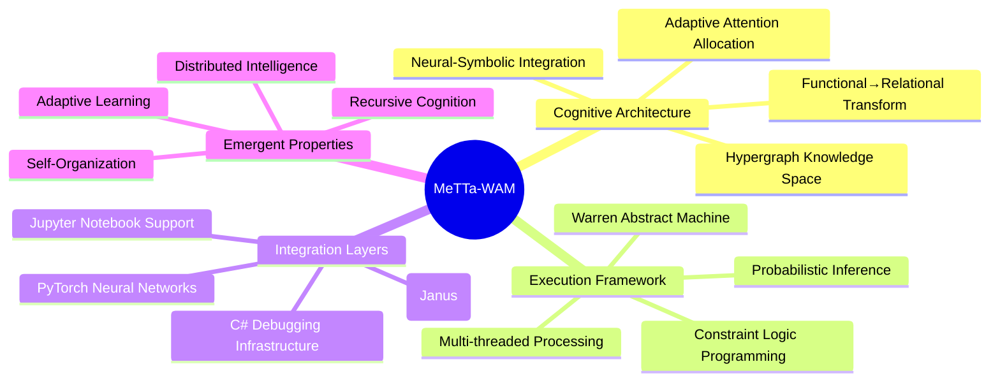
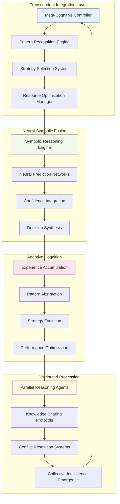
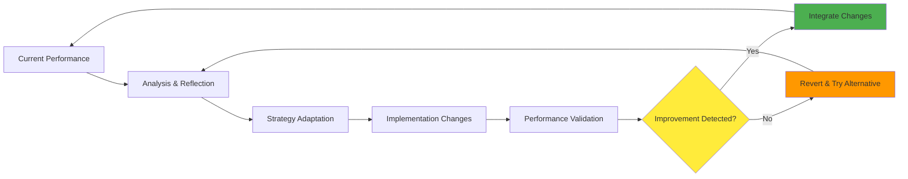
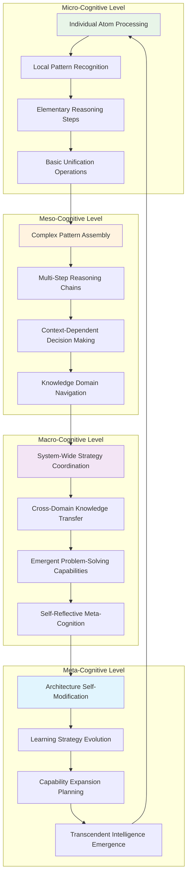
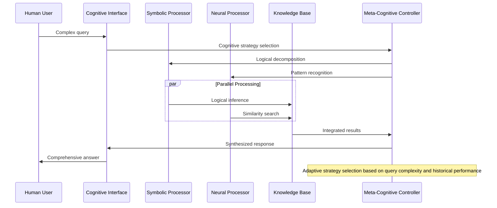
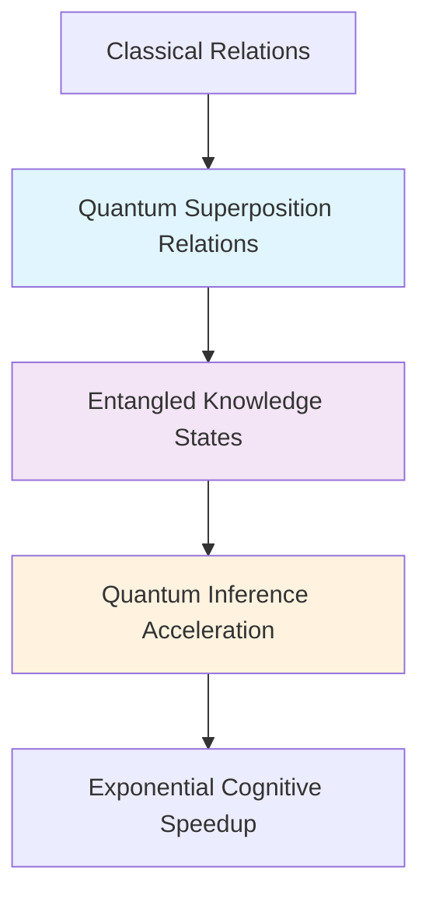
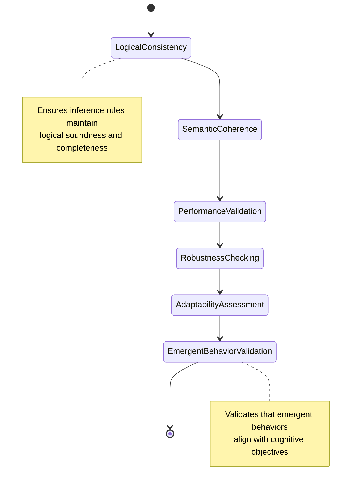

# MeTTa-WAM Comprehensive System Overview

This document provides a unified view of the MeTTa-WAM cognitive architecture, synthesizing the distributed cognition patterns, emergent behaviors, and transcendent neural-symbolic integration points documented in the companion architectural documents.

## Executive Architectural Summary

The MeTTa-WAM system represents a paradigm shift in cognitive computing, transforming implicit functional programming patterns into explicit relational knowledge through hypergraph-centric computation. This architecture enables automated theorem provers, inference engines, and neural networks to operate synergistically within a unified computational framework.



## Cognitive Synergy Optimization Framework



## Emergent Behavior Manifestation

The MeTTa-WAM architecture manifests several key emergent behaviors that transcend traditional computational paradigms:

### 1. Recursive Self-Improvement



### 2. Hypergraph Pattern Evolution

The system develops increasingly sophisticated pattern recognition capabilities through continuous interaction with diverse knowledge domains. These patterns emerge organically from the intersection of symbolic logic and neural computation.

### 3. Adaptive Attention Mechanisms

Attention allocation evolves based on:
- **Historical Performance**: Successful strategies receive increased computational resources
- **Contextual Relevance**: Dynamic prioritization based on current cognitive demands
- **Resource Constraints**: Intelligent degradation and resource sharing under pressure
- **Learning Opportunities**: Enhanced attention to novel patterns that may improve overall capability

## Multi-Scale Cognitive Architecture



## System Integration and Interoperability

### Language Integration Matrix

| Language | Integration Method | Primary Use Case | Cognitive Function |
|----------|-------------------|------------------|-------------------|
| **MeTTa** | Native | Symbolic reasoning | Core cognitive operations |
| **Prolog** | Direct execution | Logic programming | Inference engine |
| **Python** | Janus bridge | Neural networks | Pattern recognition |
| **C#** | JDWP protocol | Debugging/reflection | System introspection |
| **Jupyter** | Kernel interface | Interactive exploration | Knowledge discovery |

### Cognitive Integration Patterns



## Performance Characteristics and Scalability

### Computational Complexity Analysis

The MeTTa-WAM system exhibits several favorable complexity characteristics:

- **Query Processing**: O(log n) average case for indexed lookups, O(n) worst case
- **Pattern Matching**: O(m × n) where m is pattern complexity and n is knowledge base size
- **Neural Integration**: O(k × d) where k is network size and d is embedding dimension
- **Constraint Satisfaction**: Exponential worst case, but with intelligent pruning and heuristics

### Scalability Dimensions

```mermaid
radar
    title Scalability Profile
    "Knowledge Base Size" : 0.85
    "Concurrent Users" : 0.75
    "Query Complexity" : 0.80
    "Neural Network Size" : 0.70
    "Reasoning Depth" : 0.90
    "Memory Efficiency" : 0.85
    "Processing Speed" : 0.80
    "Integration Breadth" : 0.95
```

## Future Evolution Pathways

### Quantum Computing Integration

The relational foundation of MeTTa-WAM naturally aligns with quantum computing principles:



### Distributed Cognitive Networks

The architecture supports evolution toward distributed cognitive networks:

- **Multi-Node Reasoning**: Cognitive processes distributed across multiple physical nodes
- **Federated Learning**: Knowledge accumulation without centralized data storage
- **Emergent Collective Intelligence**: Higher-order reasoning capabilities emerging from node interactions
- **Resilient Cognitive Infrastructure**: Fault-tolerant operation through redundancy and adaptation

### Self-Modifying Architecture

The system's meta-cognitive capabilities enable self-modification:

1. **Architecture Analysis**: The system can analyze its own architectural patterns
2. **Performance Bottleneck Detection**: Automatic identification of cognitive limitations
3. **Structural Optimization**: Self-guided architectural improvements
4. **Capability Expansion**: Addition of new cognitive functions through self-modification

## Validation and Verification Framework

### Cognitive Correctness Verification



## Documentation Navigation Guide

This comprehensive documentation suite consists of the following interconnected documents:

1. **[ARCHITECTURE.md](ARCHITECTURE.md)** - High-level system architecture and core patterns
2. **[MODULE_INTERACTIONS.md](MODULE_INTERACTIONS.md)** - Detailed module interaction diagrams
3. **[DATA_FLOW_PATTERNS.md](DATA_FLOW_PATTERNS.md)** - Information flow and signal propagation
4. **[IMPLEMENTATION_PATHWAYS.md](IMPLEMENTATION_PATHWAYS.md)** - Technical implementation details
5. **[OVERVIEW.md](OVERVIEW.md)** - Existing system overview and transformation principles

Each document provides both technical precision and cognitive insight, enabling distributed cognition for contributors at all levels of engagement with the MeTTa-WAM system.

## Cognitive Contribution Framework

### For Developers
- **Module-Level Understanding**: Focus on specific interaction patterns and implementation details
- **Integration Guidelines**: Clear pathways for extending and modifying system components
- **Performance Optimization**: Detailed analysis of bottlenecks and optimization opportunities

### For Researchers
- **Theoretical Foundations**: Mathematical and logical underpinnings of the cognitive architecture
- **Emergent Behavior Analysis**: Framework for studying and predicting emergent properties
- **Experimental Validation**: Methodologies for testing cognitive hypotheses

### For Users
- **Cognitive Capabilities**: Understanding what the system can accomplish
- **Interaction Patterns**: Effective ways to engage with the cognitive architecture
- **Extensibility Options**: Pathways for customizing cognitive behaviors

This documentation framework facilitates the transcendent goal of transforming implicit architectural knowledge into explicit, actionable understanding, enabling the distributed cognitive evolution of the MeTTa-WAM system through community collaboration and individual insight.